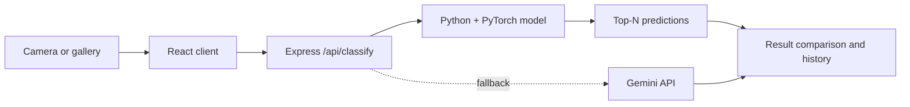

<div align="center">

# LeatherMind · 革识

面向皮革纹理识别的双语 Web 应用，支持拍照、上传、AI 分类、可视化比对与历史记录。

[](https://react.dev/)
[](https://www.typescriptlang.org/)
[](#scope-and-limitations)

</div>

## Features

- 相机拍摄与相册上传，支持取景框裁切、重拍和分析确认
- 本地 PyTorch 推理优先，失败时可回退到 Gemini API
- Best Match、Top 3 Similar Matches 与参考图对比
- 中英文切换、深浅主题与移动端布局
- 历史搜索、备注、单条/批量删除和统计
- 后端历史模式不可用时自动降级为浏览器本地存储

## How it works



## Quick start

Requirements: Node.js 22+; Python 3.10+ is recommended for local inference.

```bash
git clone https://github.com/YanYihann/Leather-Texture-Classifier.git
cd Leather-Texture-Classifier
npm ci
cp .env.example .env
npm run dev
```

Windows PowerShell can use `Copy-Item .env.example .env` instead of `cp`.

Example environment values:

```env
VITE_API_BASE_URL=http://localhost:3000
VITE_GEMINI_API_KEY=your_optional_fallback_key
```

Open `http://localhost:3000`.

## Deployment

- **GitHub Pages:** frontend only; configure `VITE_API_BASE_URL` to a separately deployed API.
- **Render / Docker:** full-stack deployment using the included `Dockerfile` and `render.yaml`.
- **Local phone testing:** the included Windows scripts can start the app and a configured Cloudflare Tunnel.

For server inference, provide the model and dataset paths expected by the deployment, such as `MODEL_PATH` and `DATASET_DIR`.

## Repository map

```text
src/             React application
public/          Local static assets and reference images
server.ts        Express API and static server
inference.py     Python model inference entry point
classes.json     Class labels
metadata.json    Model/application metadata
Dockerfile       Container build
render.yaml      Render deployment definition
```

## Scope and limitations

This is a prototype classifier, not a certified quality-control instrument. Accuracy depends on the training data, lighting, camera, crop, and deployed model. Do not use predictions as the sole basis for safety-critical, financial, or manufacturing acceptance decisions.

History may be shared in server mode and device-local in fallback mode. Review retention, access control, consent, and deletion requirements before processing real customer images.

## License

No license file is currently included.


